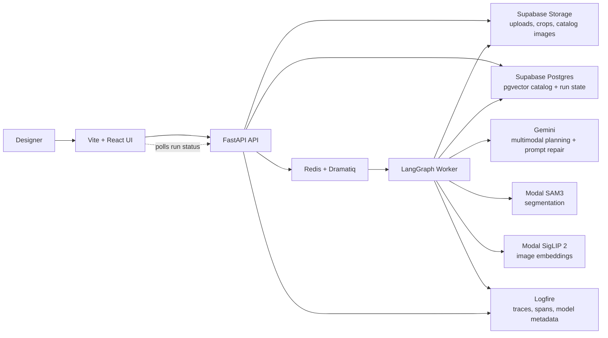
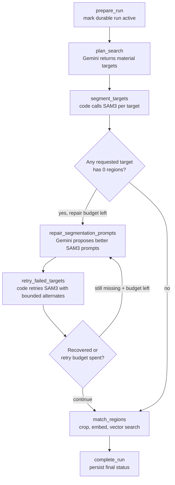
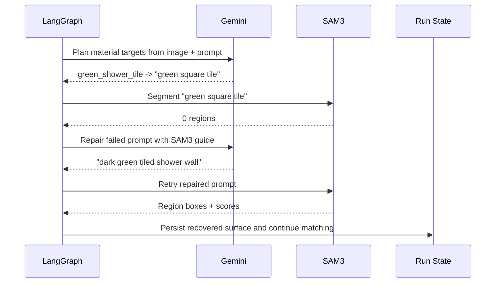

# Material Search

Material Search is a prototype for image-first material sourcing. A designer uploads a reference image and describes the surfaces they want. The system plans material targets, segments the relevant regions, embeds the crops, and retrieves orderable catalog matches.

The project is built for the Material Bank Applied AI Engineer interview brief: multimodal understanding, SAM3-style visual tooling, embedding retrieval, LangGraph orchestration, product-quality UI, and production-minded observability.

## What It Does

1. The user uploads or selects a room image and enters a sourcing prompt.
2. Gemini reads the image and prompt, then returns structured material targets.
3. LangGraph calls SAM3 for each target using short visual segmentation prompts.
4. If SAM3 returns zero regions for a target, LangGraph asks Gemini to repair the SAM3 prompt and retries with bounded alternate prompts.
5. Successful regions are cropped, stored, embedded with SigLIP 2, and matched against the catalog vector index.
6. The frontend polls durable run state and reveals surfaces, matches, and sample actions as the run progresses.

## Architecture



## Agent Loop

The LangGraph workflow is intentionally agentic but bounded. The graph owns orchestration, persistence, retry limits, and tool execution. Gemini owns reasoning steps that benefit from multimodal context.

```text
prepare_run
  -> plan_search
  -> segment_targets
  -> route_after_segmentation
      -> repair_segmentation_prompts
      -> retry_failed_targets
      -> route_after_segmentation
  -> match_regions
  -> complete_run
```



The important design choice is that Gemini does not directly run an open-ended SAM3 tool loop. Instead:

- Gemini plans targets and repairs failed SAM3 prompts.
- LangGraph decides when repair is allowed and how many retries are permitted.
- Code calls SAM3, validates results, persists IDs, stores crops, embeds images, and writes matches.

This keeps the workflow debuggable, cost-bounded, and production-friendly while still letting the model reason over failures.

## SAM3 Prompt Repair

The planner prompt includes a compact SAM3 guide:

- Describe a visible segmentable region, not a product search.
- Use color, material, surface or object, and location when useful.
- For repeated small materials such as tile, target the larger visible surface.
- Prefer prompts like `dark green tiled shower wall` over `green square tile`.

If a target returns zero SAM3 regions, the graph calls Gemini again with the original image, original user prompt, target metadata, failed prompt, and the guide. Gemini returns 1-3 alternate prompts. The graph retries them in order and stops at the first successful segmentation.



## Data And Trust Boundaries

Models are allowed to decide:

- User intent summary
- Material targets
- SAM3 prompts
- Prompt repairs after zero-region failures

Code owns:

- Run IDs and target IDs
- Retry limits
- SAM3 calls and returned boxes
- Region IDs and artifact paths
- Crop generation and storage
- Embeddings and vector search
- Similarity scores and product IDs
- Durable run status and failure handling

That boundary keeps model output useful without letting it corrupt persisted state.

## Observability

Logfire traces the end-to-end worker run. Important spans include:

- `material_search.plan_search`
- `material_search.gemini_generate_plan`
- `material_search.segment_target`
- `material_search.repair_segmentation_prompts`
- `material_search.retry_failed_target`
- `material_search.match_region`

The Gemini SDK is instrumented so prompts, structured outputs, token usage, and model metadata are visible on the trace. SAM3 attempts include prompt, target, attempt number, region count, and repaired-from prompt when applicable.

## Why This Matters For Material Search

Material sourcing from images is not just object detection. The system has to translate a designer's intent into segmentable visual surfaces, recover when a model prompt is too narrow, and connect regions to orderable catalog data. The graph structure is designed to make that loop inspectable and improvable: every failed prompt, repaired prompt, region, crop, embedding, and match can be evaluated.

## Running Locally

```bash
./scripts/dev.sh
scripts/demo-prep.sh
```

Open:

```text
http://127.0.0.1:5173/material-search/
```

Run backend tests:

```bash
scripts/test-backend.sh
```

Run frontend tests:

```bash
npm --prefix frontend run test:run
```
