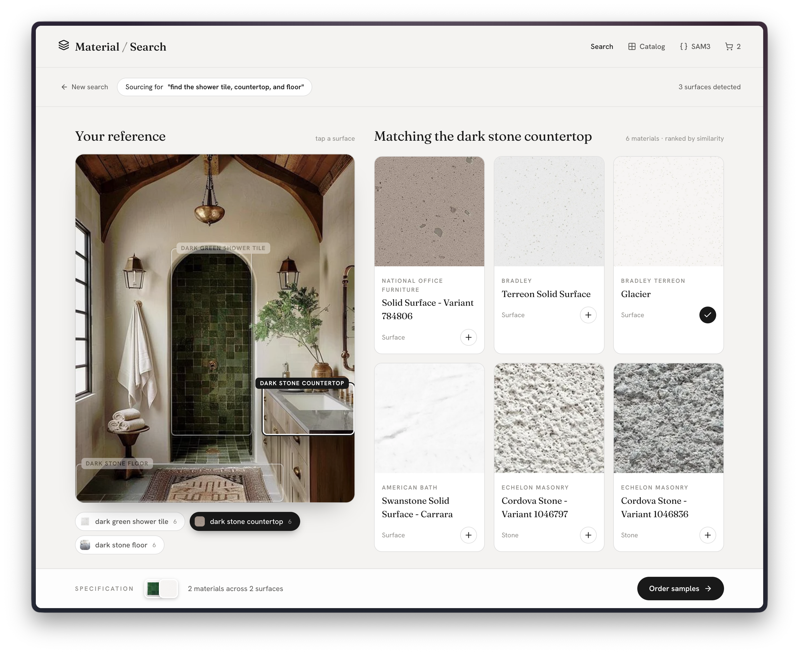
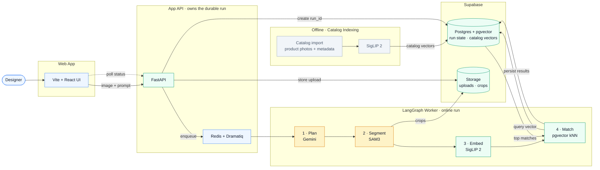
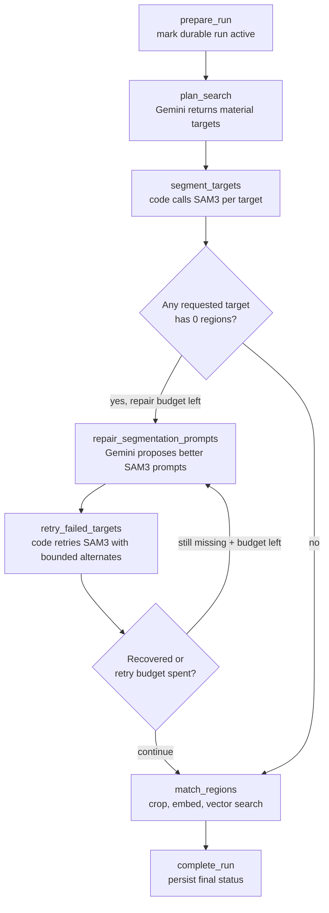
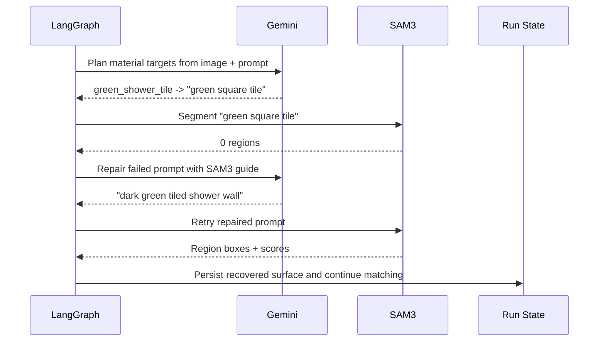

# Material Search

**Image-first material sourcing.** A designer uploads a reference image and describes the surfaces they want; the system plans material targets, segments the relevant regions, embeds the crops, and retrieves orderable catalog matches.

Built as an end-to-end, production-shaped system — not a notebook demo. It runs on real model services (Gemini, Modal-hosted SAM3, SigLIP 2), durable async search runs, a real material catalog indexed into pgvector, and full-trace observability. There are no stubbed or local-only model paths.

**[Watch the demo video →](https://youtu.be/EiHJ7k3Hz8A)**.



## Highlights

For a quick read, these are the parts worth looking at and where they live:

- **Bounded agentic orchestration** — a LangGraph workflow plans, segments, embeds, and matches, with the model reasoning where it helps and code owning everything persisted. Deliberately a single bounded agent loop, not an open-ended multi-agent system — the workflow stays debuggable and cost-bounded. → [Agent Loop](#agent-loop)
- **A self-correcting vision loop** — when SAM3 returns zero regions, the graph asks Gemini to repair the segmentation prompt and retries within a fixed budget. → [SAM3 Prompt Repair](#sam3-prompt-repair)
- **Multimodal → RAG, end to end** — Gemini (multimodal planning) → SAM3 (segmentation) → SigLIP 2 (embeddings) → pgvector nearest-neighbor retrieval. → [Architecture](#architecture)
- **An explicit model/code trust boundary** — models choose concepts, regions, and prompts; code owns IDs, boxes, embeddings, similarity scores, and run state. → [Model and Code Trust Boundary](#model-and-code-trust-boundary)
- **Evals on model behavior, plus a feedback-to-eval roadmap** — planner, retrieval, and model-smoke suites guard model behavior today; product signals become human-curated eval candidates later. → [Evaluation](#evaluation)
- **Production-minded by default** — durable runs, queue-based workers, end-to-end Logfire tracing with GenAI token/metadata capture, and gated deploys with post-deploy health verification. → [Deployment and CI](#deployment-and-ci)
- **Named trade-offs, not accidents** — model choice, retry budgets, GPU scaledown, and retrieval over-fetch are each a deliberate speed/cost/accuracy decision. → [Engineering Trade-offs](#engineering-trade-offs)

## Stack

| Layer | Choice |
| --- | --- |
| Frontend | Vite + React + TypeScript; Storybook captures run states (planning, segmenting, matching, complete) and an interactive SAM3 playground independently of the app route |
| API | FastAPI + Pydantic request/response schemas |
| Orchestration | LangGraph with typed Pydantic graph state; Dramatiq + Redis for durable search-run jobs |
| Data | Supabase Postgres + pgvector (run state, catalog metadata, embeddings, matches); Supabase Storage (uploads, crops, catalog images) |
| Model services | Gemini (multimodal planning + prompt repair), Modal-hosted SAM3 (segmentation), SigLIP 2 (image embeddings) |
| Observability | Logfire / OpenTelemetry with Gemini SDK instrumentation |
| Deployment | Render (backend API + worker) · GitHub Pages (frontend) · Modal (GPU model services: SAM3, SigLIP 2) |

## What It Does

1. The user uploads or selects a room image and enters a sourcing prompt.
2. Gemini reads the image and prompt, then returns structured material targets.
3. LangGraph calls SAM3 for each target using short visual segmentation prompts.
4. If SAM3 returns zero regions for a target, LangGraph asks Gemini to repair the SAM3 prompt and retries with bounded alternate prompts.
5. Successful regions are cropped, stored, embedded with SigLIP 2, and matched against the catalog vector index.
6. The frontend polls durable run state and reveals surfaces, matches, and sample actions as the run progresses.

## Architecture

Models advise; code owns. The diagram colors that boundary: **yellow nodes are where a model chooses** (Gemini plans targets, SAM3 segments) and **green nodes are where code is the authority** (embeddings, vector search, persisted IDs, durable run state). The numbered `1 → 4` chain is the path a single search run takes; the faded offline path shows how catalog vectors get into pgvector before any search happens.



> Logfire traces every step of the run; it is omitted from this diagram to keep the data path clean and is covered in [Observability](#observability) below.

## Agent Loop

The LangGraph workflow is intentionally agentic but bounded. The graph owns orchestration, persistence, retry limits, and tool execution. Gemini owns reasoning steps that benefit from multimodal context.

```text
prepare_run
  -> plan_search
  -> segment_targets
  -> route_after_segmentation
      -> repair_segmentation_prompts
      -> retry_failed_targets
      -> route_after_segmentation
  -> match_regions
  -> complete_run
```



The important design choice is that Gemini does not directly run an open-ended SAM3 tool loop. Instead:

- Gemini plans targets and repairs failed SAM3 prompts.
- LangGraph decides when repair is allowed and how many retries are permitted.
- Code calls SAM3, validates results, persists IDs, stores crops, embeds images, and writes matches.

This keeps the workflow debuggable, cost-bounded, and production-friendly while still letting the model reason over failures.

## SAM3 Prompt Repair

The planner prompt includes a compact SAM3 guide:

- Describe a visible segmentable region, not a product search.
- Use color, material, surface or object, and location when useful.
- For repeated small materials such as tile, target the larger visible surface.
- Prefer prompts like `dark green tiled shower wall` over `green square tile`.

If a target returns zero SAM3 regions, the graph calls Gemini again with the original image, original user prompt, target metadata, failed prompt, and the guide. Gemini returns 1-3 alternate prompts. The graph retries them in order and stops at the first successful segmentation.



## Model and Code Trust Boundary

The boundary that keeps model output useful without letting it corrupt persisted state:

| Models may decide | Code owns |
| --- | --- |
| User intent summary | Run IDs and target IDs |
| Material targets | Retry limits |
| SAM3 prompts | SAM3 calls and returned boxes |
| Prompt repairs after zero-region failures | Region IDs and artifact paths |
| | Crop generation and storage |
| | Embeddings and vector search |
| | Similarity scores and product IDs |
| | Durable run status and failure handling |

A concrete consequence: catalog categories are never inferred from free text. The planner must choose an explicit `material_family_hint` from the allowed catalog filters, and code validates it against the allowlist and drops anything else — there is no keyword-to-category guessing anywhere in the pipeline.

## Evaluation

Model behavior is the fragile part of a system like this, so it is guarded by hand-authored eval suites that run with the normal backend tests:

- **Planner evals** (`backend/tests/test_planner_evals.py`) — assert the planner returns structured targets, respects the region budget, guards against over-segmentation, preserves negative constraints, declines non-material requests, generates stable target IDs, retries transient model errors with backoff, and **drops invalid free-text catalog filters instead of keyword-matching**.
- **Retrieval evals** (`backend/tests/test_retrieval_evals.py`) — track top-k material-family hit-rate and empty-match-rate as retrieval-quality metrics.
- **Model-smoke evals** (`backend/tests/test_model_smoke_evals.py`) — enforce region-score and crop-dimension invariants so a bad segmentation cannot flow silently downstream.

The roadmap is deliberate, not aspirational:

- **Live-service expansion** (`docs/evals/model-evals-todo.md`) — a small real-image fixture set with high-level assertions (regions above threshold, bounded crops) run against the live SAM3 endpoint, gated separately from CI.
- **Feedback-to-eval pipeline** (`docs/architecture/future-eval-architecture.md`) — real product workflow signals (saving a material, ordering a sample, reformulating a search) surface eval *candidates* for human review. User behavior flags examples; it never becomes ground truth automatically.

## Observability

Logfire traces the end-to-end worker run. Important spans include:

- `material_search.plan_search`
- `material_search.gemini_generate_plan`
- `material_search.segment_target`
- `material_search.repair_segmentation_prompts`
- `material_search.retry_failed_target`
- `material_search.match_region`

The Gemini SDK is instrumented so prompts, structured outputs, token usage, and model metadata are visible on the trace. SAM3 attempts include prompt, target, attempt number, region count, and repaired-from prompt when applicable.

## Deployment and CI

Everything deploys from `main` through GitHub Actions (`.github/workflows/`):

- **Gated API deploys** — `deploy-api.yml` triggers a Render deploy, polls until the deploy reports `live`, then verifies the production `/healthz` endpoint and fails the workflow if the service is unhealthy.
- **UI to GitHub Pages** — `deploy-ui.yml` builds and publishes the frontend that backs the live demo link above.
- **Model services and schema as code** — `deploy-modal-services.yml` ships the SAM3 and SigLIP GPU services to Modal; `deploy-supabase-migrations.yml` applies database migrations.
- **Catalog indexing as an operational job** — `index-catalog.yml` runs catalog embedding/upsert on demand against the production services, not a local shortcut.
- **Live SAM3 smoke test** — `smoke-sam3.yml` is a dispatchable workflow that segments a real prompt against the deployed GPU endpoint, asserts a minimum region count, and traces the run in Logfire.
- **Infra validation** — `validate-infra.yml` checks the Render blueprint and Supabase configuration whenever infra files change.

## Engineering Trade-offs

A system like this has to balance speed, scalability, latency, cost, and accuracy. The decisions here are explicit:

| Decision | Trade-off |
| --- | --- |
| Planner runs on `gemini-3.1-flash-lite`, with a documented larger-model alternate | Speed and cost per run over maximum planning capability; the eval suite is what makes swapping models safe |
| Repair loop capped at a fixed retry budget per target | Accuracy recovery without unbounded model spend or latency |
| Modal GPU services use a 20-minute scaledown window plus an explicit warmup script | Cold-start latency traded against idle GPU cost, with warmup for demo-critical paths |
| Category-filtered retrieval over-fetches candidates (capped multiplier), then post-filters in code | Exact structured filtering without biasing the embedding-space search, at the cost of a slightly larger fetch |
| Dramatiq worker runs embedded in the web service on a free tier | Demo-scale cost; the queue boundary already exists, so splitting workers out is configuration, not redesign |

## Known Limitations and Roadmap: Mood Board Discovery

The system is strongest when the designer gives specific intent, such as "find the countertop and rug" or "match the wall tile." Dense mood boards expose a different problem: before SAM3 can segment anything, the system has to *discover* every small material sample worth matching. A planner-first flow is brittle here, because the vision model has to notice every partially visible swatch, tile, hardware piece, and stone sample before any segmentation evidence exists.

The repo includes mood-board planner evals that make this limitation visible on purpose. The production answer is not brute-force keyword prompts or dozens of SAM3 calls, but a dedicated region-proposal stage:

1. A best-in-class multimodal model proposes all visible candidate material regions in one structured call, including boxes, labels, and confidence.
2. Code validates coordinates, filters impossible boxes, dedupes overlaps, and creates stable candidate IDs.
3. SAM3 refines accepted candidate boxes into tighter masks/crops where the deployed API supports box prompts; until then, code crops directly from validated proposal boxes.
4. A planner/selector LLM classifies each candidate as material vs. prop, selects one explicit catalog category, and decides whether to match it.
5. Accepted crops flow through the existing SigLIP embedding and pgvector retrieval pipeline.

This keeps the current build cost-bounded while showing the intended production path: proposal, validation, refinement, classification, retrieval.

## Why This Matters

Material sourcing from images is not object detection. The system has to translate a designer's intent into segmentable visual surfaces, recover when a model prompt is too narrow, and connect regions to *orderable* catalog data. The graph structure is built to make that loop inspectable and improvable: every failed prompt, repaired prompt, region, crop, embedding, and match is persisted and can be evaluated.

## Running Locally

```bash
./scripts/dev.sh
scripts/demo-prep.sh
```

Open:

```text
http://127.0.0.1:5173/material-search/
```

Run backend tests:

```bash
scripts/test-backend.sh
```

Run frontend tests:

```bash
npm --prefix frontend run test:run
```
