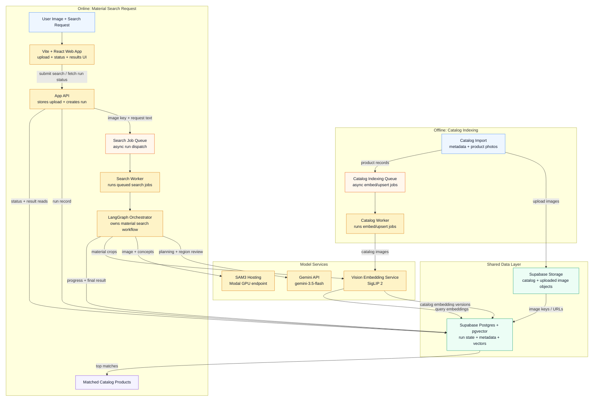

# Cloud Material Finder Architecture

## Notes

- This diagram is the target architecture for the rewrite, not a map of the current toy implementation.
- Postgres should store stable image URLs or object keys, not image bytes.
- Prefer `google/siglip2-so400m-patch14-384` over the original OpenAI CLIP model for material-image retrieval.
- Embedding model changes create incompatible vector spaces. Reindex by adding a new embedding version, not by blindly overwriting existing vectors.
- A useful target shape is `catalog_items` for product metadata and `catalog_item_embeddings` for `{ catalog_item_id, model_id, dimensions, embedding, created_at }`.

## Chosen Stack

- Frontend: Vite + React + TypeScript.
- App API: FastAPI with Pydantic schemas for request/response contracts.
- Orchestration: LangGraph inside Python workers; Pydantic for typed graph state and structured model outputs.
- Queues: Dramatiq + Redis, with coarse-grained jobs for search runs and catalog indexing.
- Data: Supabase Postgres + pgvector for run state, catalog metadata, embeddings, and match results.
- Object storage: Supabase Storage for catalog images, uploaded images, and generated crop/mask artifacts.
- Model services: Gemini API for multimodal planning, Modal-hosted SAM3 for segmentation, and SigLIP 2 for image embeddings.

## Model Choices

- Use `gemini-3.5-flash` for the planner/selector. It is the current stable Flash model and fits the need for fast multimodal reasoning over the room image, user request, and SAM3 region candidates.
- Use SAM3 for segmentation because the system needs precise boxes/masks for open-vocabulary material concepts. The LLM decides what to ask for; SAM3 produces the spatial evidence.
- Use SigLIP 2 for material retrieval because the catalog and query crops need to share one modern image-embedding space. The same model version should embed both catalog photos and user-image crops.
- Keep the trust boundary explicit: models can choose concepts, regions, and descriptions, but code owns persisted IDs, boxes, confidence scores, embeddings, nearest-neighbor search, product IDs, and similarity values.

## LLM Decides Intent, Code Owns Evidence

The LLM is responsible for interpreting the user's natural-language request and
the reference image into material targets, SAM3 prompts, priorities, and
explanatory intent. Code is responsible for evidence: persisted run IDs,
planned target rows, SAM3 boxes/masks/scores, crop artifacts, embedding vectors,
catalog item IDs, similarity values, and final stored results. Negative
preferences such as "avoid anything too glossy" should first be captured as
planner metadata; they should only affect filtering/ranking once
there is explicit evidence in catalog metadata or retrieval signals.

Follow-up note: add planner evals later for constraint handling, including a
case like "Find materials like the floor and green seating, but avoid anything
too glossy."

## Scalability

- Treat each material search as a durable run, not a one-off in-memory request.
  - The API creates a `run_id`, stores the uploaded image key and request text, enqueues work, and lets the client poll status.
  - Persist key outputs as the graph advances: selected concepts, SAM3 regions, crop/mask keys, catalog matches, status, errors, and final summary.
  - A useful target shape is `material_search_runs`, `material_search_regions`, and `material_search_matches`.
  - Postgres is the durable memory of the run; LangGraph owns the workflow while the worker is executing it.
- Start with coarse-grained queues: one job per catalog indexing unit and one job per user search run. LangGraph manages the steps inside a search run.
  - This keeps the first version easier to reason about while the product path is still being proven.
  - At much higher traffic, each LangGraph node could become its own queue job so segmentation, LLM planning, crop embedding, and pgvector search can scale independently.
  - Node-level queueing would also improve retries and backpressure because SAM3 GPU work, LLM calls, and embedding work have different latency, cost, and failure modes.
  - The tradeoff is extra state serialization, idempotency requirements, more queues, and harder debugging.
